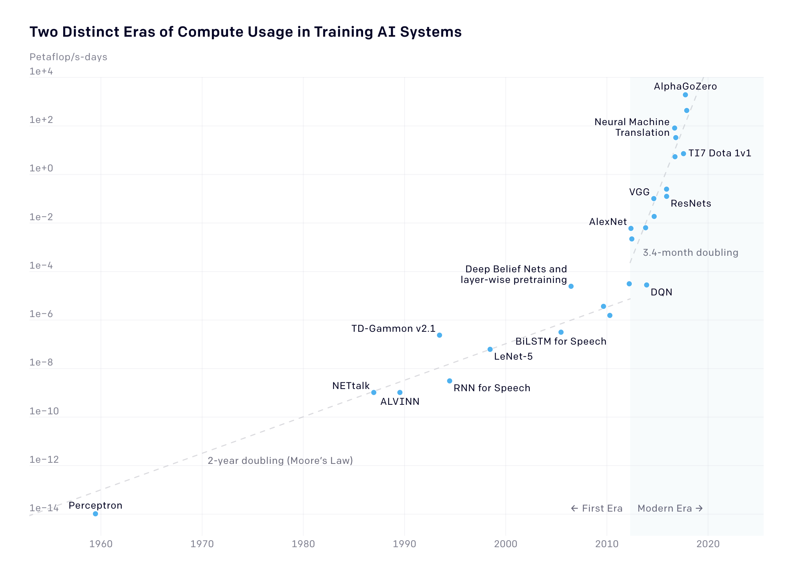

# Notes from AMLD 2020

<https://appliedmldays.org/schedule>

Some repos are stored here: <https://github.com/amld>

## Conference plan

- Saturday AM: Interpretability in Comp Bio <https://github.com/IBM/depiction/tree/master/workshops/20200125_AMLD2020>

- Saturday PM: PyTorch <https://github.com/theevann/amld-pytorch-workshop>

- Sunday AM: Transfer Learning at scale in Natural Language Processing

- Sunday PM: Cross-Lingual NLP **terrible code, interesting material**  

- Monday AM: Keynotes

- Monday PM:
  - Health, lots of short talks <https://appliedmldays.org/tracks/ai-health>
  - <https://appliedmldays.org/tracks/ai-ml-on-the-edge>
  - 4pm <https://appliedmldays.org/talks/machine-learning-for-bioimage-informatics-successes-challenges-and-perspectives>

- Tuesday AM: 4BC <https://appliedmldays.org/tracks/ai-pharma>

- Tuesday PM: 1A <https://appliedmldays.org/tracks/ai-molecular-world>
  - Note there's also
    - NLP <https://appliedmldays.org/tracks/ai-nlp>
    - Zitnik, Large-scale prediction of phenotypes from biological networks 15:30 - 16:10, 2A, AI & Nutrition

- Wednesday AM: Keynotes <https://appliedmldays.org/tracks/wednesday-keynote-session>

- Wednesday PM: ??
  - Governance 2 panels <https://appliedmldays.org/tracks/ai-governance>
  - Skills <https://appliedmldays.org/tracks/ai-skills>

## Day 1 - Interpretability in Comp Bio

### Interpretability

#### Gradient-based methods

Ancona et al, Towards better understanding of gradient-based attribution methods for Deep Neural Networks

 <https://arxiv.org/abs/1711.06104>

#### Perturbation-based methods

Marco Tulio Ribeiro, Sameer Singh, Carlos Guestrin, "Why Should I Trust You?": Explaining the Predictions of Any Classifier

 <https://arxiv.org/abs/1602.04938>

Ribiero, Anchors:

 <https://homes.cs.washington.edu/~marcotcr/aaai18.pdf>

 Attention as interpretabilty: interpret alpha's like beta in linear model. See Bengio et al: "learning to align and...""

Girardi,Patient Risk Assessment and Warning Symptom Detection Using Deep Attention-Based Neural Networks

 <https://arxiv.org/abs/1809.10804>

#### Adversial robustness

 Explanations based on the Missing: Towards Contrastive Explanations with Pertinent Negatives, Amit Dhurandhar, Pin-Yu Chen, Ronny Luss, Chun-Chen Tu, Paishun Ting, Karthikeyan Shanmugam, Payel Das

<https://arxiv.org/abs/1802.07623e>

Counterfactual Explanations without Opening the Black Box: Automated Decisions and the GDPR, Sandra Wachter, Brent Mittelstadt, Chris Russell

<https://arxiv.org/abs/1711.00399>

#### Rule-based models

Generalized Linear Rule Models DennisWei1 Sanjeeb Dash TianGao Oktay Gunluk
<http://proceedings.mlr.press/v97/wei19a/wei19a.pdf>

#### Example-based

"This looks like that"

#### Shapely

Calculates payout player/feature deserves

#### Surrogate methods

#### Multi-interpretation problems

IBM upcoming article on modelling how to combine expert interpretation/annotation.

### Libraries

Depiciton

<https://kipoi.org> - omics model view.

<https://science.sciencemag.org/content/332/6030/687/tab-figures-data>

## Day 1 - Pytorch intro

<https://github.com/theevann/amld-pytorch-workshop>

### Torch Tensors

`torch.tensor` behaves like numpy arrays under mathematical operations. However, `torch.tensor` additionally keeps track of the gradients (see next notebook) and provides GPU support.

CAUTION: Operator `*` does element-wise multiplication, just like in numpy!
`Y.t() * Y`  # error, dimensions do not match for element-wise multiplication. As does `+` etc.

Each PyTorch tensor operation is also available as a function.

Functions that mutate (in-place) the passed object end with an underscore, e.g. `add_, div_`, etc.

Indexing works like in numpy.

`view(*shape) → Tensor`
Returns a new tensor with the same data as the self tensor but of a different shape. The returned tensor shares the same data and must have the same number of elements, but may have a different size. `-1` tells PyTorch to infer the number of elements along that dimension. Equivalent of 'reshape' in numpy (view does not allocate new memory!)

`expand()`  # similar to repeat but does not actually allocate new memory

`squeeze()` # removes all dimensions of size '1'

### Autograd

`.backward()` accumulates the gradients. If you want fresh values, you need to set x.grad to zero before you call .backward().

### Optimisation

In the example below `optimizer` keeps track of what you need:

```python
0 = 8
lr = 0.1
iterations = 10

x = torch.Tensor([x0]).requires_grad_()
y = f(x)

# Define your optimizer
optimizer = optim.Adam([x], lr=lr)

for i in range(iterations):

    y = f(x)
    y.backward() # compute gradient
    optimizer.step() # does everything - knows the function x
    optimizer.zero_grad()

    print(y.data)
```

Note that in nn architectures, the softmax activation function of the final hiiden layer  goes in the loss function in Pytorch convention:

```python
class CrossEntropyLoss(_WeightedLoss):
    r"""This criterion combines :func:`nn.LogSoftmax` and :func:`nn.NLLLoss` in one single class...
```

### CNNs

First kernel gives vertical lines. Transpose to get horizontal lines.

Need as many kernels as output channels.

## Day 2 Transfer Learning at scale in Natural Language Processing

<https://tinyurl.com/wrgy3r4>

HuggingFace Transformers library being used.

### Intro

Word2vec: Distributional Hypothesis (1954): “a word is characterized by the company it keeps”
Static embedding methods are not very good at encoding the context. One vector for one word.
RNN weight sharing  

RNN: information needs kept for a long time in internal states.

Attention: importance of every token for every other token - Query Key product (care: matrix vis in slides is random!)

BERT introduced bidirectionality by using a transformer instead of an LSTM encoder

Uses two objectives:
Mask Language Model (MLM)
next sentence prediction (NSP)

Uses special tokens to format the input: [CLS], [SEP], [MASK]

### Using BERT

Frozen BERT + task layers

Adapters: “Parameter-efficient Transfer Learning for NLP”  <http://proceedings.mlr.press/v97/houlsby19a.html>
Adapters ⇒ obtain good accuracy with less weights to tune!
Catastrophic forgetting: forgetting what you learn in the pretraining task. Use small learning rates to avoid big changes or regularization. ULMfit: Especially for lower layers which capture general information (<https://arxiv.org/abs/1801.06146).> Learning rate warmup.

#### Several methods are possible

- Freezing everything but the top layer (<https://arxiv.org/abs/1502.02791)>

- Training one layer at a time (<https://www.aclweb.org/anthology/D17-1169/)>

- Gradually unfreezing (<https://arxiv.org/abs/1801.06146)>

- Finetune all parameters.

What/when to choose:
“To Tune or Not to Tune? Adapting Pretrained Representations to Diverse Tasks”, <https://arxiv.org/pdf/1903.05987.pdf>

#### Issues with BERT

The feedforward pass is slow (Bert Large  has 335M parameters)

Fine-tuning is very unstable (<https://arxiv.org/pdf/1811.01088.pdf)>

Memory problems if the maximum sequence length  is long

You can pre-train your own version of Bert on your dataset
Requires lots of GPUS/TPUS
Tricky to choose hyper-parameters

#### Excerise 1 - Finetuning BERT IMDB sentiment analysis

Tested a bit on mac. Moved over to colab for GPU:

Here are some of the main parameters you will want to consider when finetuning BERT:

- Gradient Clipping: If the norm of the gradient gets above max_grad_norm, We divide the gradient by its L2 norm. This gradient clipping method avoids exploiding gradients.

- Learning rate: The learning_rate parameter is very important as it controls how we update the already trained parameters from the Language Modelling Task. If this parameter is too high, we will notice a forgetting of the previous task. It needs to be carefully tuned.

- Sequence length: The attention mechanism scales in O(L^2). So you should avoid handling sequences larger than what you really need.

#### Tokenization, Word Pieces and out-of-vocabulary words

BERT uses Word pieces. Tokens are sequences of characters - optimized. This is useful for out of vocabulary words. Word pieces are kinda of doing stemming.

The input to the bert model are word-pieces (Original paper). Standard tokens are broken down into word pieces through the use of a WordPiece tokenizer.

A WordPiece tokenizer breaks the unknown words into multiple subwords. For example, if the word "chore" does not belong to the vocabulary as a single piece, it might get split into two pieces belonging to the vocabulary: 'cho' and '##re'.

All the subwords start with the "#" symbol except for the first subword in the word. Imagine the words "played", "playing" are rare words and thus would not occur in a normal vocabulary. These words would be considered into the wordpiece tokenizer into this form: [play, ##ed] and [play, ##ing].

You can have a look at the file bert-base-uncased-vocab.txt in your environnment to have an idea of the words present in the vocabular

Wordpiece tokenizers tends to be quite slow, however some efficient implementations exist: tokenizers from the huggingface Library are much faster than the standard naive implementations (Implemented in Rust with python bindings).

#### Padding

There is padding to max sequence length

#### Task

Note [CLS] token is always appearing first for the classification task.

`768` - is the bert hidden layer size

Note finetuning loop is very simple: no early stopping etc.

#### Results

Spacy tokenizer is the simple classifier user. BERT is much  better for F1-score, but not other metrics covering speed and size etc.

### Transfer Learning At Scale

#### Tokenization

HuggingFace Tokenizer is much faster.

#### Distillation

Same data point goes to student and teacher. Teacher not trained, only student. Student training tries to mimic student (student loss).

Approach 1: Replace label with Teacher predictions. Allows us to apply to much more unlabbled data

Approach 2: Uses labels. MSE on logits plus cross-entropy loss. Some work “Distilling Task-Specific Knowledge from BERT into Simple Neural Networks”:   <https://arxiv.org/abs/1903.12136v1>
showed that the best performance had the cross-entropy turned off!

### Quantization

Why quantize:

- Models benefit from hardware optimizations → faster

- Significantly reduce the memory footprint! → Smartphone friendly!

- On deep network, quantization usually do not significantly degrade the performances

- BERT and other large model inference on CPU is very slow. Quantized version is faster.

See: “quantization-in-tflite” <https://sahnimanas.github.io/post/quantization-in-tflite/>

and: “Pytorch quantization” <https://pytorch.org/docs/stable/quantization.html>

Models can be quantized post-training and during training.

- During training: Quantize weights in the forward pass
Backward pass and the update are with regard to the unquantized weights

- Post-training: Use unquantized weights while training
Quantize weights after training and perform inference

Quantization is very simple:

```python
import torch.quantization

def print_size_of_model(model):
    """""
    Get the size on disk of the model
    """""
    torch.save(model.state_dict(), "temp.p")
    print('Size (MB):', os.path.getsize("temp.p")/1e6)
    os.remove('temp.p')


bert.eval()
bert.cpu()

# As simple as that:
quantized_bert = torch.quantization.quantize_dynamic(
    bert, {nn.Linear}, dtype=torch.qint8
)
```

Quantized BERT took 61 seconds whereas full BERT took 78 seconds.

Note the scores aren't great in the notebook just because we took only 100 datapoints to save time.

### Serving models at scale

-Containerize your model to make replication easy

-Use spot instances (Cost savings)

-Orchestrate your containers for autoscaling

-Handle the serving, logging, monitoring, ...

One open source solution on AWS:

<https://www.cortex.dev/>

### Correlation vs Causation

Clever Hans - attending to specifc signals but not learning. Entailment.

<https://thegradient.pub/nlps-clever-hans-moment-has-arrived/>

“Right for the Wrong Reasons: Diagnosing Syntactic Heuristics in Natural Language Inference” <https://www.aclweb.org/anthology/P19-1334.pdf>

- The paper shows that Bert “closely tracks statistical regularities in the training set”
→ Which is prone to adopting superficial heuristics

- Good test data is the most valuable there is!
→ It’s ok to have a test and train dataset from different distribution if the test data is better matching what you’re aiming for.

- A lot of work need to be done to understand what models are exactly learning

## Day 2 - Cross-lingual NLP

Catastrophic code failures! I've deleted any local work. Just go and try to make sense out of the files on my github.

<https://github.com/ioannispartalas/CrossLingual-NLP-AMLD2020>

Good for low resource langauges.

Vectorization: semantically similar words can have different vectors.
Text representation: traditional **bag-of-words**. Given a text, extract the vocabulary, build a vector of dim $|V|$, non-zeros are words that appear. Bag of words obviously does not capture word order.

<https://arxiv.org/abs/1706.04902>

<https://arxiv.org/abs/1812.10464>

## Day 3 AM - Conference Keynotes

Ethics: 'original why it was possible' instead of regulatory. Policy people  also need to know ML.

<https://www.heidi.news/newsletters>

<https://www.remotecon.org/index.html>

<https://www.extensionschool.ch/>

sli.do AMLD2020 <https://app.sli.do/event/uldojaf3/live/questions>

### ML without growing team at Swisscom

What comes after breaking the silos (last year). So many ops. How to prioritise?

- What else is this data good for?

- How can integrate constraints and objectives? Fairness.

- I am using everything relevant?

Multiobjective sgd requires gradient normalization.

Evaluating the Search Phase of Neural Architecture Search
Kaicheng Yu et al:  <https://arxiv.org/abs/1902.08142>

### Dataiku

Pitch for product

### Learning Actionable Representations of Biomedical Data, Marinka Zitnik

<https://stanford.edu/~marinka/>

videolectures.net › icgeb_zitnik_graph_neural_networks
Graph neural networks for computational drug repurposing

<http://helikoid.si/cms/>

<https://r2learning.github.io/>

Overview of ops for ML in health and medicine, but it's challenging:

- Data integration, confounded, scales

- Actionable outputs.

Networks and data integration: Population - individuals - molecular. **AD mentioned**

Actionable outputs: target id, treatment.

#### Example - drug repurposing

Bipartite graph of drug-disease interactions.

Disease as subgraph of rich protein network on disease proteins.

Drug as subgraph of rich protein network on drug's trarget proteins.

Drug likely to treat disease if close in pharamcological space, but what does this mean.

Method: SUGAR.

Graph NN, neural message passing.

Stanford SPARK translational gave drug disease repurposing data  - supervised.

Highlight what part of molecular structure are important

GNNExplainer: Generating Explanations
for Graph Neural Networks

Neurips: <https://papers.nips.cc/paper/9123-gnnexplainer-generating-explanations-for-graph-neural-networks.pdf>

To Embed or Not: Network Embedding as a Paradigm in Computational Biology
<https://www.frontiersin.org/articles/10.3389/fgene.2019.00381/full>

Deep Learning for Network Biology:
<http://snap.stanford.edu/deepnetbio-ismb/>

<https://www.iscb.org/ismb2020-submit/proceedings>

### Roche: Making Personalised Healthcare a reality? – More than AI, Asif Jan

Asking the right q, getting the right data. Collaborate.

Electronic medical records. RWE.

EDIS data mart. Clinical, omics and imaging. >40k patients. FAIR data, Wilkinson ete al Scientific Data 2016:3.

Flatiron partner. Foundation medicine.

Carrigan et al, Clin Pharmacol Ther 2019.

Using RWE as control data to reduce burden on control arm: Using Electronic Health Records to Derive Control Arms for Early Phase Single-Arm Lung Cancer Trials: Proof-of-Concept in Randomized Controlled Trials.
<https://www.ncbi.nlm.nih.gov/pubmed/31350853>

PicnicHealth MS. Williams et al ECTRIMS 2019.

Curtis et al Health Surv Res 2018: 53.

Improved curation and quality (manual and auto) to improve results.

RANN: Roche advanced analytics data network. Crowd sourced across Roche. Win lunch with CEO. Lots of good models - ensembles.

### Buhler  - Data Science for sustainable manufacturing

Digital twin. Replay productions. Mobile rice quality monitor.

### Swiss, Re Institute. Bohn: Addressing the failure of enterprise machine intelligence (MI) with 4 AIs we should discuss more

Lots of failures. Bad planning. A load of guff. Gartner.

binderhub

Need to explain in 'ai'

- hyper focussed.
- integrate in business
- not regular it projects
- mlops
- right tool for q
- hr

4ais:

- Augmented
  - human in the loop

- Automation
  - data ingestion and curation
  - ml for upstream data clearning etc.
  - mlops
  - can lead to glaring mistakes. human-in-loop

- Assessed Intelligence
  - prefer robustness, stability, interpretability

- Adaptive Intelligence
  - physical models, RL
  - behaviour mimicking?

Causal inference.

### Unity: Simulations – The New Reality for AI, Danny Lange

Simulations for annotation and dataset creation. 100% true ground truth? But who fixed the physics/simulations and what may be missed.

RL: explore v exploit. observe, action, reward.

RL robots. Peter Pastor. Too long. Need simulated data.  

**Planck time?!**

Beating evolution

- faster than 30 fps (human preferred)
- parallelism
- blend species and individual
- step back in time (checkpointing)
- lower frequency: drop fill frames. But who decides?

### **Microsoft and Novartis: Machine Learning at Exa-scale: Opportunities for Life Sciences**, Shahram Ebadollahi & Christopher Bishop

3 key elements
- Data
- No free lunch. Prior knowledge. Less data, more prior knowledge needed.
- Massive compute.

The Bitter Lesson - Sutton. 

OpenAI compute over time graph <https://openai.com/blog/ai-and-compute/>:



Exponential growth up to 2010 in ML SOTA compute (Moores law of transistors -> compute). Since 2010, doubling time dropped to 3.5 months. 10x increase every 12 months.

5mb - complete works of shakespear. cf BERT.

Imperative to stay on trajectory. Huge ask, few companies. Microsoft invested in OpenAI, who move to MS for exa-scale compute. How? e.g  Graphcore 23.6 billion transistors. 

Cholera example. John Snow. Epidemiology invented. 

**Novartis**

<https://dblp.org/pers/hd/e/Ebadollahi:Shahram>

Body as complex data generator.

Data42. 2x10ˆ6 patient year of data. Lots about disease progression and longitudinal studies.

Challenges:

- Drug design. Space of all chem compounds 10ˆ60. Still heavily expert driven. HT assays and compounds. Graph NN for molecule. Message passing. NeurIPS 18. Autoencoder for molecule. How smooth is this space. Framed as Netlix recommender with parameters fixed. 

- Age related macular disease. Vision loss. CV augmented human vision. Deep CV on eye images for precision timing and dosing of drug. 

400 people hackathon for P(success). 12 month fellowships for ML non-bio people. 

<https://dblp.org/pers/hd/e/Ebadollahi:Shahram>

## Day 3 - PM - Parallel Tracks

### Education -  Enhancing human learning via spaced repetition optimization, Manuel Gomez Rodriguez

<https://https://ari9000.com/> code: AMLD 

Leitner systems for cards. 

Modelling decay of memory. Half-life regression. It looks like this could use survival analysis. Censoring?  

Stochastic optimal control for review. 

### **Health - Roche - Mapping medical vocabulary terms with word embeddings, Pekka Tiikkainen**

Drug safety department. e.g. what is baseline event rate? ICD9-CM + 10. MedDRA RWD databases. Need to map vocabulary, often manually done before. 

Use word embeddings. word2vec CBOW (context-> word) or skip-gram (word -> context).

Used MIMIC3 and Roche internal data. 

Baseline: term concurence. See photo. 

Pancreatic cancer often metstasticise in lungs, hence appearance in lung results. 

fasttext and word2vec outperformed baseline. Corpus choice didn't change much.

### **Imaging - EMBL-EBI - Machine Learning for Bioimage Informatics: Successes, Challenges, and Perspectives, Virginie Uhlmann**

Prepared with Anne Carpenter, Jan Funke, Florian Jub, Anna Krushuk.

Huge datasets being generated. Each image is information dense. Keller lab:  <Digital-embryo.org>. Cryo-EM Toro-Nahuelpan et al, Nature 2019, Tailoring cryo-electron microscopy grids by photo-micropatterning for in-cell structural studies, <https://www.biorxiv.org/content/10.1101/676189v1>

Want: quantitative, scalable and reproducible.

Bioimaging - each experiment has its own kind of images. Question -> find something! 

ilastik - rf classifier looks very powerful. Kreshuk group.

Image restoration, image preprocessing, image based modelling. 

Martin Weigert et al. Nature Methods 2019, Content-aware image restoration: pushing the limits of fluorescence microscopy, <https://www.nature.com/articles/s41592-018-0216-7>
Use high-light low noise regions to learn how to make high noise, low light. Then reverse. 

Noise2void: Krull et al CVPR 19. Learn what is correlated (signal) and what is uncorrelated (noise), then remove noise. 

Funke lab - Image understanding. EM images. Neuron tracing. 

Buhmann et al, Automatic Detection of Synaptic Partners in a Whole-Brain Drosophila EM Dataset, https://www.biorxiv.org/content/10.1101/2019.12.12.874172v1. 
Eckstein et al. Neurotranslitter classification.  Predict what kind of neurotransmitter is released in some regions. 

Kruskuk et al: Complete Cryo-EM imaging of platynereis flat worm. 8TBs. 12k cells. 

#### Image-based modelling
Soham Mandal et al, biorxiv 19. CNN- > morphology. Diff. geometry. eg 6-cell stage mouse embryo. Hiiragi group EMBL. Deformation infers cell function? Diffeomorphic mapping? Sharpe group, Barcelona. .

Carpenter lab: Cell Profiler. Images for drug discovery. Juan. Caicedo et al. CVPR 18, Weakly Supervised Learning of Single-Cell Feature Embeddings, <http://openaccess.thecvf.com/content_cvpr_2018/html/Caicedo_Weakly_Supervised_Learning_CVPR_2018_paper.html>
What is the latent representation learnt? Note that annotators didn't know that mutations causing cancer. Network manages to identify mutation clusters. 

See also Rohban et al, mental health work. Distribution in low dim space is different depending on norma and disorders. 

Challenges: Annotation, integrate omics, correlate imaging techniques. 

Community : image.sc<https://forum.image.sc/> 

Nature Methods: Deep Learning in Microscopy.

### Health -  Beyond lesion count: machine learning based imaging markers in multiple sclerosis

Liu et al Lancet Digital Health, A comparison of deep learning performance against health-care professionals in detecting diseases from medical imaging: a systematic review and meta-analysis. <https://www.thelancet.com/journals/landig/article/PIIS2589-7500(19)30123-2/fulltext>

Most MS lesions have a vein in the middle - how the disease propagates.

Ravano et al disconectome ECTRIMS 19.

## Day 3  - Evening session

### Vetterli

<https://www.theguardian.com/books/2019/oct/24/human-compatible-ai-problem-control-stuart-russell-review>

Ball: How to grow a human. 

RUR Kapek

### Kosinski - The End of Privacy

500mb digital footprint everyday in 2012 (IBM).

3 traits link personality and face.

Hormones affect faces. 

Traits from faces: People get about 54% in lab test. Think about how gender can be determined. Brain just not evolved to this yet. Computer hits work colleague level  of accuracy.

Predicting political views from faces: 90% accurate.

Privacy is already lot. We need to make the post-privacy world livable. The problem is not privacy, it is e.g. homophobia.

### Tegmark

Ultrasound for everyone:  https://www.butterflynetwork.com/

Asilomar 2017, Principles: <https://futureoflife.org/ai-principles/?cn-reloaded=1>

<https://www.nationalgeographic.com/news/2016/03/you-and-almost-everyone-you-know-owe-your-life-to-this-man/>

AI Feynman: a Physics-Inspired Method for Symbolic Regression
Silviu-Marian Udrescu (MIT), Max Tegmark (MIT)
(Submitted on 27 May 2019)
A core challenge for both physics and artificial intellicence (AI) is symbolic regression: finding a symbolic expression that matches data from an unknown function. Although this problem is likely to be NP-hard in principle, functions of practical interest often exhibit symmetries, separability, compositionality and other simplifying properties. In this spirit, we develop a recursive multidimensional symbolic regression algorithm that combines neural network fitting with a suite of physics-inspired techniques. We apply it to 100 equations from the Feynman Lectures on Physics, and it discovers all of them, while previous publicly available software cracks only 71; for a more difficult test set, we improve the state of the art success rate from 15% to 90%.

<https://arxiv.org/abs/1905.11481>

<https://rodneybrooks.com/blog/>

AI in sustainable development goals. Tegmark et al. 


